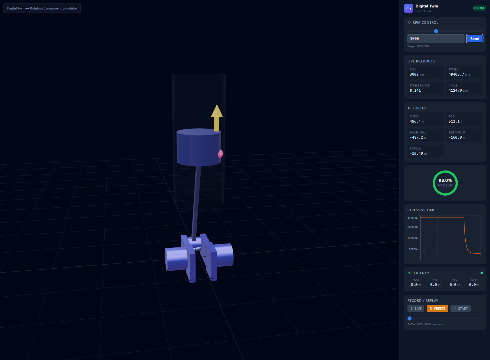
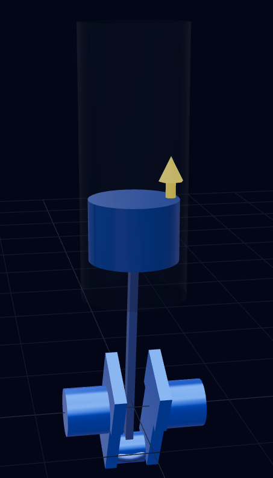

# Digital Twin — Crankshaft & Piston Simulator

A real-time digital twin that simulates the dynamics of a **crankshaft-piston mechanism**, computing inertial forces, stresses, and torque at 100 Hz in a C++20 backend, and rendering a live 3D visualization with force arrows in a Next.js dashboard.

<p align="center">
  
</p>

## Screenshots

<p align="center">
  
  &nbsp;&nbsp;
  
</p>

<p align="center">
  <em>Left: Low stress at idle — mechanism stays blue.
  Right: High RPM — stress-driven coloring shifts to red, force arrows grow.</em>
</p>

---

## Features

### Physics Engine (C++20)

- **Crank-slider kinematics** — piston position, velocity, and acceleration derived analytically from crank angle
- **Five force outputs per tick:**
  - **Piston inertia force** — `F = m·R·omega²·(cos θ + λ·cos 2θ)`
  - **Connecting rod force** — `F_rod = F_piston / cos φ`
  - **Tangential force** — `F_t = F_rod · sin(θ + φ)` (drives crankshaft rotation)
  - **Instantaneous torque** — `T = F_t · R`
  - **Side thrust** — lateral force on the cylinder wall: `F_side = F_piston · tan φ`
- **Centrifugal stress model** — `stress = m·r·omega² / A`, normalized to a 0–1 stress factor
- **Smooth RPM response** — exponential filter with τ = 0.35s for realistic spool-up/spool-down
- **100 Hz fixed timestep**, 10-second ring buffer history (1000 samples)

### WebSocket Server (Boost.Beast)

- **JSON protocol** at 100 Hz — state broadcast with RPM, angle, stress, forces, torque, timestamp
- **Zero-copy-ish broadcast** — `snprintf` into a rotating pool of pre-allocated 512-byte buffers shared across all clients via `shared_ptr`
- **Lock-free snapshot** — physics thread writes atomically, IO thread reads without blocking
- **Bidirectional** — clients can send `set_rpm` and `replay` commands

### 3D Dashboard (Next.js 14 + React Three Fiber)

- **Crankshaft-piston mechanism** built from primitives — segmented journals, crank webs, counterweights, connecting rod with bearings, piston with wrist pin
- **Stress-driven coloring** — all parts lerp from blue (0 stress) to red (max stress) based on `stress_factor`
- **Live force arrows** rendered in-scene:
  - Amber — piston inertia force (vertical)
  - Green — tangential force at crank pin (perpendicular to arm)
  - Pink — side thrust on cylinder wall (horizontal)
- **Square-root arrow scaling** so forces are visible across the full 0–8000 RPM range
- **Transparent cylinder bore** shows the piston's stroke path
- **Control sidebar** with RPM slider, live readouts, force panel, fatigue gauge, stress chart, latency stats, and replay controls

---

## Architecture

```
 ┌─────────────────────┐        WebSocket (ws://localhost:3001)        ┌──────────────────────────┐
 │   backend-cpp       │ ────────── state JSON @ 100 Hz ────────────▶ │   frontend-next          │
 │   C++20 / Boost     │ ◀──────── set_rpm / replay cmds ──────────── │   Next.js / R3F / Three  │
 └─────────────────────┘                                               └──────────────────────────┘
         │                                                                        │
    Physics loop                                                           useFrame (60fps)
    100 Hz tick                                                            reads Zustand store
         │                                                                        │
   PhysicsEngine::step()                                                  Scene.tsx updates
   ├─ RPM smoothing                                                       ├─ crankshaft rotation
   ├─ angle integration                                                   ├─ piston position
   ├─ centrifugal stress                                                  ├─ rod angle
   ├─ piston inertia force                                                ├─ stress coloring
   ├─ rod / tangential / torque / side thrust                             └─ force arrows
   └─ atomic snapshot
```

---

## Repository Structure

```
digital_twin/
├── .gitignore
├── README.md                          ← you are here
├── docs/images/                       ← screenshots
│
├── backend-cpp/
│   ├── CMakeLists.txt                 C++20 build config
│   ├── CMakePresets.json              Base presets (version-controlled)
│   ├── conanfile.py                   Conan 2 deps (Boost, Eigen, nlohmann-json)
│   ├── README.md                      Backend-specific docs
│   └── src/
│       ├── main.cpp                   Server, WebSocket sessions, broadcast loop
│       ├── PhysicsEngine.h / .cpp     Simulation: RPM, angle, stress, forces, torque
│       ├── Protocol.h                 JSON protocol (zero-copy snprintf serialization)
│       └── RingBuffer.h              Lock-free ring buffer template
│
└── frontend-next/
    ├── package.json                   Next.js 14 + R3F + Zustand + Recharts
    ├── tailwind.config.js
    └── src/
        ├── app/
        │   ├── layout.tsx
        │   ├── page.tsx               Main page layout
        │   └── globals.css
        ├── components/
        │   ├── Scene.tsx              3D crankshaft-piston + force arrows
        │   ├── Sidebar.tsx            RPM controls, readouts, forces, fatigue gauge
        │   ├── StressChart.tsx        Stress vs time chart
        │   ├── LatencyPanel.tsx       Latency stats display
        │   └── ReplayControls.tsx     Record/replay UI
        ├── hooks/
        │   └── useTwinSocket.ts       WebSocket client with auto-reconnection
        ├── lib/
        │   ├── protocol.ts            Protocol types + type guards
        │   └── ringBuffer.ts          Client-side ring buffer
        └── store/
            └── twinStore.ts           Zustand state management
```

---

## Quick Start (Windows)

### Prerequisites

- C++ development environment
- **CMake 3.21+** (bundled with VS2022)
- **Conan 2** — `pip install conan`
- **Node.js 18+** LTS
- (optional) **Visual Studio 2022** with C++ Desktop workload

### 1. Backend

```powershell
# One-time Conan setup
pip install conan
conan profile detect

# Install dependencies
cd backend-cpp
conan install . --build=missing -s build_type=Release

# Build
cmake --preset conan-release
cmake --build --preset conan-release

# Run
.\build\Release\twin_server.exe
```

You should see:
```
=== Digital Twin Backend ===
WebSocket server listening on ws://localhost:3001
Health check: http://localhost:3001/health
[stats] clients=0 broadcast_rate=100 Hz rpm=1200
```

### 2. Frontend

```powershell
cd frontend-next
npm install
npm run dev
```

Open [http://localhost:3000](http://localhost:3000).

### 3. Use it

- Drag the **RPM slider** or type a value and press **Send**
- Watch the crankshaft spin, piston reciprocate, and force arrows oscillate
- Observe the stress coloring shift from **blue** (low) to **red** (high)
- Read live forces, torque, stress, and fatigue life in the sidebar

---

## Protocol Reference

### Server → Client (100 Hz)

```json
{
  "type": "state",
  "payload": {
    "rpm": 3000.0,
    "angle_rad": 1.5708,
    "stress_pa": 49403.7,
    "stress_factor": 0.141,
    "piston_force_n": 486.4,
    "rod_force_n": 512.1,
    "tangential_force_n": -487.2,
    "torque_nm": -19.49,
    "side_thrust_n": -160.0,
    "timestamp_ms": 1234567890123
  }
}
```

### Client → Server

```json
{ "type": "set_rpm", "payload": { "rpm_target": 3000 } }
```

```json
{ "type": "replay", "payload": { "mode": "freeze" } }
```

---

## Physics Model

| Constant | Value | Description |
|---|---|---|
| `kCrankThrow` | 0.04 m | Crank throw radius (80 mm stroke) |
| `kConRodLength` | 0.128 m | Connecting rod length |
| `kPistonMass` | 0.4 kg | Piston + wrist pin mass |
| `kMass` | 2.5 kg | Rotating assembly mass (for centrifugal stress) |
| `kRadius` | 0.08 m | Stress calculation radius |
| `kArea` | 0.0004 m² | Cross-section area |
| `kTau` | 0.35 s | RPM smoothing time constant |
| `kRpmMax` | 8000 | Maximum RPM |
| `kDt` | 0.01 s | Simulation timestep (100 Hz) |
| `lambda` | 0.3125 | Crank throw / rod length ratio |

Force equations (inertial only, no gas pressure):

- **Piston acceleration**: `a = -R·omega²·(cos θ + λ·cos 2θ)`
- **Piston force**: `F_piston = m_piston · a`
- **Rod obliquity angle**: `φ = asin(λ · sin θ)`
- **Rod force**: `F_rod = F_piston / cos φ`
- **Tangential force**: `F_t = F_rod · sin(θ + φ)`
- **Torque**: `T = F_t · R`
- **Side thrust**: `F_side = F_piston · tan φ`

## Troubleshooting

| Issue | Fix |
|---|---|
| Port 3001 in use | Change `kPort` in `backend-cpp/src/main.cpp` |
| Conan install fails | Run `conan profile detect`, check MSVC is detected |
| CMake preset not found | Re-run `conan install` for the desired build type |
| Frontend can't connect | Verify backend is running, check browser console for WS errors |
| Slow first build | Normal — Conan compiles Boost from source (~5 min first time) |
| WebSocket disconnects | Check firewall rules for localhost:3001 |
| Forces all zero | Rebuild backend — force fields were added after initial build |

---

## Performance Notes

- **Backend**: single serialization per tick into a shared buffer pool — no per-client heap allocation
- **Frontend**: 3D updates at 60 fps via `useFrame` reading Zustand store directly (no React re-renders per tick)
- **Ring buffer** ingests 100 samples/sec without triggering component re-renders
- **Charts** decimated to 200 points max to prevent rendering bottlenecks
